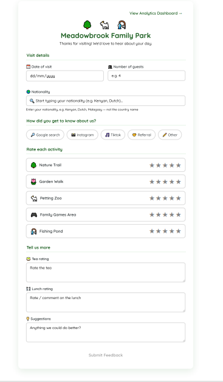
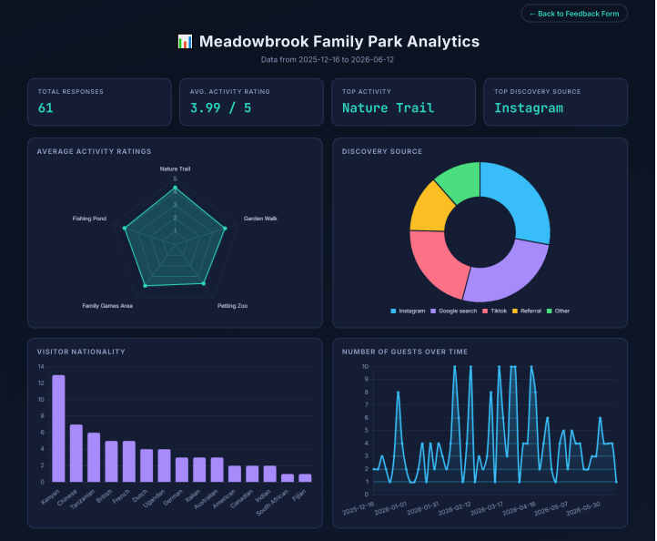
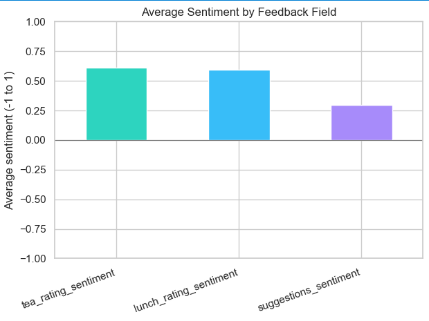
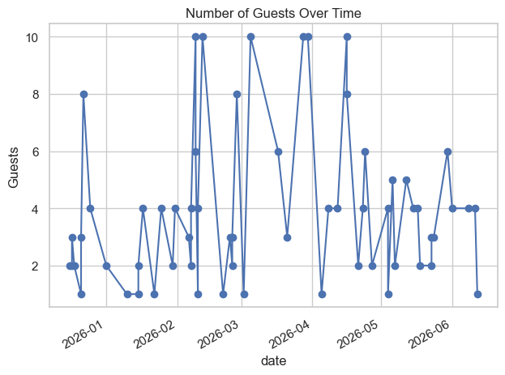

# Meadowbrook Family Park-Feedback & Analytics

A visitor feedback system for a family park featuring a nature trail, garden walk, petting zoo, family games area, and a fishing pond. Visitors fill out a feedback form after their visit, responses are stored in a CSV file, and the data can be explored live in a dashboard or analyzed in depth with a Jupyter notebook.

The project is deliberately minimal, no database, just a small Express API, a CSV file, and static HTML pages, so the whole stack is easy to read end to end.

## Screenshots






## Tech stack

- **Backend**: Node.js + Express, reading/writing a CSV file (no database)
- **Frontend**: vanilla HTML/CSS/JavaScript, charts via Chart.js (CDN)
- **Analytics**: Python (pandas for data manipulation, matplotlib & seaborn for visualization) in a Jupyter notebook, with VADER-based sentiment analysis on the free-text feedback
- **Testing**: Jest + Supertest covering the backend's validation, CSV-injection guard, and both API endpoints

## Project structure

```
feedback-analytics-dashboard/
├── Backend/
│   ├── index.js                 # Express API (reads/writes feedback.csv)
│   ├── index.test.js            # Jest + Supertest tests for both endpoints
│   ├── feedback.csv             # Feedback data
│   ├── generate_sample_data.js  # Regenerates feedback.csv with varied synthetic data
│   └── testData.json            # Example payload shape for POST /submit-feedback
├── frontend/
│   ├── index.html               # Feedback form
│   └── dashboard.html           # Live analytics dashboard (Chart.js)
├── analytics/
│   ├── feedback_analysis.ipynb  # Deeper analysis notebook
│   └── requirements.txt         # Python dependencies for the notebook
└── images/                      # Screenshots used in this README
```

## How it fits together

1. **Feedback form** (`frontend/index.html`) - visitors rate 5 activities (Nature Trail, Garden Walk, Petting Zoo, Family Games Area, Fishing Pond), pick how they heard about us, and leave comments. On submit, it `POST`s JSON to `http://localhost:3000/submit-feedback`.
2. **Backend** (`Backend/index.js`) — a small Express server that validates each submission, appends it as a row to `Backend/feedback.csv`, and serves the data back as JSON via `GET /feedback-data`.
3. **Dashboard** (`frontend/dashboard.html`) - fetches `/feedback-data` and renders live charts (average rating per activity, discovery source, visitor nationality, guests over time) with Chart.js.
4. **Analytics notebook** (`analytics/feedback_analysis.ipynb`) - reads the same CSV with pandas for a deeper look: summary stats, the same charts via matplotlib/seaborn, VADER sentiment scores for the free-text fields (`tea_rating`, `lunch_rating`, `suggestions`), and ideas for further analysis.

## Running it locally

### 1. Start the backend

```bash
cd Backend
npm install
npm start
```

This starts the API on `http://localhost:3000` and reads/writes `Backend/feedback.csv`.

### 2. Open the frontend

With the backend running, open these files directly in your browser (no build step or web server needed):

- `frontend/index.html` - submit feedback (new entries are appended to `feedback.csv` and show up on the dashboard)
- `frontend/dashboard.html` - view the live analytics dashboard

> Note: the nationality field uses a bundled country-to-nationality map in `index.html`, so the form works fully offline and validates that visitors enter a nationality (e.g. "Kenyan", "Dutch") rather than a country name (e.g. "Kenya", "Netherlands") - suggesting the correct demonym if they don't, to keep the data consistent for analysis. The backend allows requests from any origin, so opening the HTML files directly (`file://`) works fine.

### 3. Run the analytics notebook (optional)

```bash
cd analytics
pip install -r requirements.txt
jupyter notebook feedback_analysis.ipynb
```

Run all cells to see summary statistics plus the same charts rendered with pandas/matplotlib/seaborn.

## Data

`Backend/feedback.csv` columns:

| Column | Description |
|---|---|
| `date` | Date of visit |
| `guests` | Number of guests in the group |
| `nationality` | Visitor nationality (demonym, e.g. "Kenyan", "Dutch" — not the country name) |
| `source` | How the visitor heard about us (Google search, Instagram, Tiktok, Referral, Other) |
| `source_details` | Free-text detail when `source` is "Other" |
| `nature_trail`, `garden_walk`, `petting_zoo`, `family_games_area`, `fishing_pond` | Activity ratings, 1–5 |
| `tea_rating` | Free-text comment on the tea tasting |
| `lunch_rating` | Free-text comment on lunch |
| `suggestions` | Free-text suggestions |

The repo ships with rows of **synthetic sample data** (generated by `generate_sample_data.js`) plus a few **manual entries submitted through the feedback form** during testing, so the dashboard and notebook have a realistic mix to show out of the box. To regenerate a fresh batch of synthetic rows (note: this overwrites `feedback.csv`, including any manually-submitted rows):

```bash
cd Backend
node generate_sample_data.js
```

## API

| Method | Path | Description |
|---|---|---|
| `POST` | `/submit-feedback` | Validate and append a feedback submission (JSON body) to `feedback.csv`. Returns `400` with a descriptive error if the data is invalid. |
| `GET` | `/feedback-data` | Return all feedback rows as JSON |

## Validation & security

- **Server-side validation** (`Backend/index.js`) - `POST /submit-feedback` checks that:
  - `date` is in `YYYY-MM-DD` format
  - `guests` is a positive whole number
  - `nationality` is non-empty
  - `source` is one of `Google search`, `Instagram`, `Tiktok`, `Referral`, `Other`
  - each activity rating (`natureTrail`, `gardenWalk`, `pettingZoo`, `familyGamesArea`, `fishingPond`) is a whole number from 1–5
  - `teaRating`, `lunchRating`, and `suggestions` are non-empty

  Invalid requests get a `400` with a descriptive error instead of crashing the server or writing a malformed row — this protects `feedback.csv` even if someone calls the API directly instead of using the form.
- **Nationality vs. country check** (`frontend/index.html`) - a bundled country-to-nationality map blocks visitors from typing a country name (e.g. "Kenya") where a nationality (e.g. "Kenyan") is expected, suggesting the correct demonym instead.
- **CSV-injection guard** (`csvEscape` in `Backend/index.js`) - any value starting with `=`, `+`, `-`, or `@` gets a leading `'`, so a comment like `=SOME(FORMULA)` is stored as harmless text instead of being executed as a formula when `feedback.csv` is opened in Excel or Google Sheets.

## Testing

The backend has a Jest + Supertest suite covering both endpoints: valid submissions, invalid input (bad date, out-of-range ratings, non-positive guest count, unknown source, missing fields), and the CSV-injection guard. Tests run against a temporary CSV file, so they never touch the real `feedback.csv`.

```bash
cd Backend
npm install
npm test
```

## Next steps

- As more responses come in, just refresh the dashboard or re-run the notebook to update all charts.
- Track sentiment trends over time (e.g. monthly average) as more volume comes in.
- Investigate activity-rating vs. comment-sentiment mismatches (high rating, negative comment, or vice versa) for follow-up.
